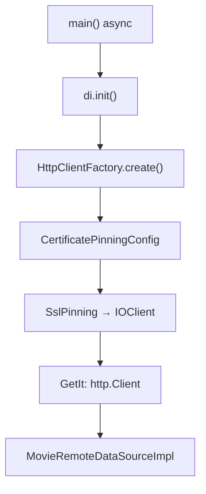

# SSL Pinning Design — ditonton (movieapp)

**Date:** 2026-06-12  
**Status:** Approved  
**Scope:** `api.themoviedb.org` API traffic only

---

## 1. Context

Flutter Expert Dicoding submission project (*ditonton*) using clean architecture with GetIt DI. All TMDB API calls go through `MovieRemoteDataSourceImpl`, which receives an `http.Client` injected via `injection.dart`.

### Current State

| Item | Status |
|------|--------|
| `lib/common/sslpinning.dart` | Exists — creates `IOClient` with pinned cert from assets |
| `certificates/certificates.crt` | Exists — registered in `pubspec.yaml` assets |
| `injection.dart` | Uses plain `http.Client()` — **pinning not wired** |
| Certificate domain | Issued for `developer.themoviedb.org` — **wrong host** (app calls `api.themoviedb.org`) |

### Requirements (from brainstorming)

| Decision | Choice |
|----------|--------|
| Goal | Dicoding submission + production-ready pattern |
| Pinning strategy | Hybrid — certificate pinning now, structure ready for SPKI later |
| When active | Always (debug and release) |
| Host scope | API only (`api.themoviedb.org`) — not `image.tmdb.org` |

---

## 2. Approach Selection

Three approaches were evaluated:

1. **Minimal wiring** — directly use existing `SslPinning` in DI. Fastest, but no migration path.
2. **Factory + config abstraction** *(selected)* — thin `HttpClientFactory` + `PinningConfig`. Balances Dicoding requirements with production readiness.
3. **Migrate to Dio + plugin** — full HTTP stack replacement. Too much refactor for this project.

---

## 3. Architecture



### New / Modified Files

| File | Action | Role |
|------|--------|------|
| `lib/common/pinning_config.dart` | **New** | Abstraction for pinning strategies |
| `lib/common/http_client_factory.dart` | **New** | Creates `http.Client` based on config |
| `lib/common/sslpinning.dart` | **Refactor** | Accepts config, returns pinned `IOClient` |
| `lib/injection.dart` | **Modify** | `init()` → `Future<void>`, register pinned client |
| `lib/main.dart` | **Modify** | `main()` → async with binding init |
| `lib/data/repositories/movie_repository_impl.dart` | **Modify** | Add `HandshakeException` handler |
| `certificates/certificates.crt` | **Replace** | Correct cert for `api.themoviedb.org` |
| `test/common/sslpinning_test.dart` | **New** | Verify pinning client configuration |
| `test/common/http_client_factory_test.dart` | **New** | Verify factory returns `IOClient` |

### Unchanged

- `MovieRemoteDataSourceImpl` — still receives `http.Client` via constructor
- `cached_network_image` — out of scope (`image.tmdb.org` uses its own HTTP stack)
- Existing data source unit tests — continue mocking `http.Client`

---

## 4. Component Design

### 4.1 PinningConfig

```dart
abstract class PinningConfig {}

class CertificatePinningConfig implements PinningConfig {
  final String assetPath;
  const CertificatePinningConfig({required this.assetPath});
}

// Placeholder — not implemented in this iteration
class SpkiPinningConfig implements PinningConfig {
  final String host;
  final List<String> allowedSpkiHashes; // base64 SHA-256 of SPKI
  const SpkiPinningConfig({
    required this.host,
    required this.allowedSpkiHashes,
  });
}
```

### 4.2 HttpClientFactory

```dart
class HttpClientFactory {
  static Future<http.Client> create(PinningConfig config) async {
    switch (config) {
      case CertificatePinningConfig(:final assetPath):
        return SslPinning.createClient(assetPath: assetPath);
      case SpkiPinningConfig():
        throw UnimplementedError('SPKI pinning not yet implemented');
    }
  }
}
```

### 4.3 SslPinning (refactored)

```dart
class SslPinning {
  static Future<IOClient> createClient({required String assetPath}) async {
    final sslCert = await rootBundle.load(assetPath);
    final securityContext = SecurityContext(withTrustedRoots: false);
    securityContext.setTrustedCertificatesBytes(sslCert.buffer.asInt8List());

    final httpClient = HttpClient(context: securityContext);
    httpClient.badCertificateCallback =
        (X509Certificate cert, String host, int port) => false;

    return IOClient(httpClient);
  }
}
```

Key behaviors:
- `withTrustedRoots: false` — only the pinned certificate is trusted (no system CA store)
- `badCertificateCallback` returns `false` — reject any certificate not matching the pinned trust chain

---

## 5. Initialization Flow

### main.dart

```dart
void main() async {
  WidgetsFlutterBinding.ensureInitialized();
  await di.init();
  runApp(MyApp());
}
```

### injection.dart

```dart
Future<void> init() async {
  // ... existing registrations (providers, use cases, repositories, data sources) ...

  final client = await HttpClientFactory.create(
    const CertificatePinningConfig(
      assetPath: 'certificates/certificates.crt',
    ),
  );
  locator.registerLazySingleton<http.Client>(() => client);
}
```

Execution order:
1. Flutter binding initialized (required for `rootBundle`)
2. `init()` creates pinned `IOClient` via factory
3. Client registered in GetIt as `http.Client`
4. `MovieRemoteDataSourceImpl` receives pinned client transparently

---

## 6. Certificate Management

### Problem

Current `certificates.crt` is issued for `developer.themoviedb.org`. The app calls `api.themoviedb.org`. Pinning will reject all API requests until the certificate is replaced.

### Fix

Extract the current leaf certificate from `api.themoviedb.org`:

```bash
openssl s_client -connect api.themoviedb.org:443 \
  -servername api.themoviedb.org </dev/null 2>/dev/null \
  | openssl x509 -outform PEM > certificates/certificates.crt
```

### Rotation Risk

TMDB uses Let's Encrypt certificates that rotate approximately every 90 days. Certificate pinning with a static `.crt` file will break when the server certificate is renewed. For long-term production use, migrate to SPKI pinning (Section 8). For Dicoding submission, certificate pinning with the correct current cert is sufficient.

---

## 7. Error Handling

When pinning rejects a certificate (mismatch or MITM attempt), Dart throws `HandshakeException` — not `SocketException`.

`MovieRepositoryImpl` currently catches `ServerException` and `SocketException` only. Add `HandshakeException` handler to every method that calls the remote data source:

```dart
} on HandshakeException {
  return Left(ConnectionFailure('Failed to verify server certificate'));
} on SocketException {
  return Left(ConnectionFailure('Failed to connect to the network'));
}
```

No new exception class needed. No UI changes required — existing `ConnectionFailure` message is displayed.

---

## 8. Future SPKI Migration Path

When TMDB certificate rotation becomes a problem (or for stronger production pinning):

1. Implement `SpkiPinningConfig` branch in `HttpClientFactory`
2. Validate in `badCertificateCallback` — compare SHA-256 hash of the certificate's SPKI against `allowedSpkiHashes`
3. Extract SPKI hash:
   ```bash
   openssl s_client -connect api.themoviedb.org:443 -servername api.themoviedb.org </dev/null 2>/dev/null \
     | openssl x509 -pubkey -noout \
     | openssl pkey -pubin -outform DER \
     | openssl dgst -sha256 -binary \
     | openssl enc -base64
   ```
4. Switch config in `injection.dart` — one line change
5. `MovieRemoteDataSource`, repository, and UI remain unchanged

---

## 9. Testing Strategy

| Test | File | Approach |
|------|------|----------|
| Existing data source tests | `test/data/datasources/movie_remote_data_source_test.dart` | **No changes** — mock `http.Client` |
| Pinning client creation | `test/common/sslpinning_test.dart` | Verify `IOClient` created with `SecurityContext(withTrustedRoots: false)` |
| Factory behavior | `test/common/http_client_factory_test.dart` | Verify factory returns `IOClient` instance |
| Live API verification | Manual | Run app, confirm movie/TV data loads successfully |

Pinning unit tests require `TestWidgetsFlutterBinding.ensureInitialized()` to access `rootBundle` for certificate loading. No HTTPS mock server needed — tests verify client configuration, not live connections.

---

## 10. Implementation Checklist

- [ ] Create `lib/common/pinning_config.dart`
- [ ] Create `lib/common/http_client_factory.dart`
- [ ] Refactor `lib/common/sslpinning.dart` (static getter → `createClient()` method)
- [ ] Replace `certificates/certificates.crt` with `api.themoviedb.org` cert
- [ ] Update `lib/injection.dart` — async init, register pinned client
- [ ] Update `lib/main.dart` — async main with binding init
- [ ] Update `lib/data/repositories/movie_repository_impl.dart` — `HandshakeException` handlers
- [ ] Add `test/common/sslpinning_test.dart`
- [ ] Add `test/common/http_client_factory_test.dart`
- [ ] Run `flutter test` — all tests pass
- [ ] Manual test — app loads movie/TV data from TMDB API
